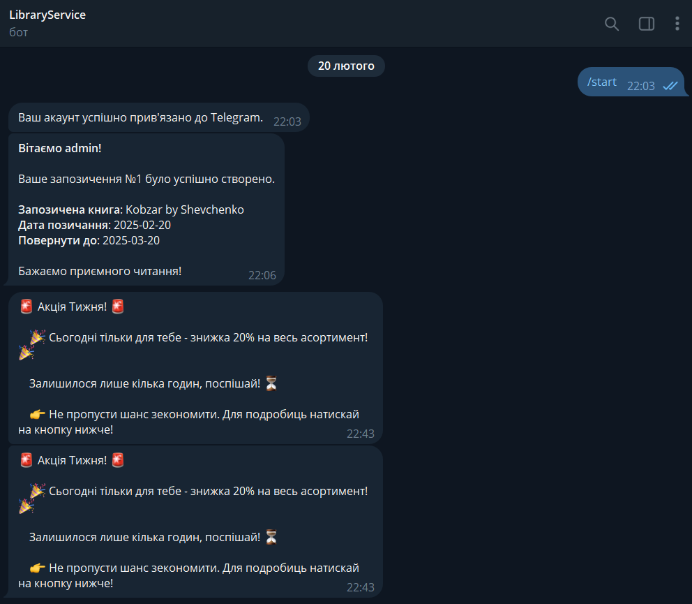

# Library Service API 📚💻

## Description 📝
Library Service API is a RESTful API designed to manage library services, 
including CRUD operations for books 📖, users 👥, and bookings 📦. 
It also integrates with a Telegram bot 📲 for notifications about bookings and promotions 🎉, 
as well as uses Celery ⏳ and Django-Celery-Beat 🕓 for asynchronous tasks 🔄.

## Key Features 🌟
- **Books Service 📚**:
    - CRUD operations for books 📝
    - Only admins 🧑‍💼 can create, update, or delete books ❌
    - All users (including unauthenticated 🚶‍♂️) can view books 👀
- **Users Service 👤**:
    - User registration ✍️ and authentication 🔑 via JWT
    - Link between users and Telegram bot 📲
- **Borrowing Service 📦**:
    - CRUD operations for book borrowing 📝
    - Availability check for books before borrowing 🔍
    - Borrowing is only available for authenticated users 🔓
    - Return books 🔙 and update stock 📦
- **Telegram Integration 📲**:
    - Telegram chat notifications when booking a book 📩
    - Promotions notifications 🎁 via Celery ⏳

## Installation & Setup ⚙️
1. Clone the repository 🖥️:
   ```bash
   git clone https://github.com/b4oody/library-service-api.git
   cd library-service-api
   ```

2. Create a virtual environment 🌍 and activate it 🎉:
   ```bash
   python3 -m venv venv
   source venv/bin/activate
   ```

3. Install the necessary dependencies ⚙️:
   ```bash
   pip install -r requirements.txt
   ```

4. Set up environment variables 🔧:
    - Create a `.env` file and add the following variables:
    ```
   #Django 🧑‍💻
   DJANGO_SECRET_KEY=<django-insecure-6_e1bm0dh#zcn2m9@@*_z@9r-*m0h2i+)&oxh!^9m3bt3w2=ha>
   DJANGO_SETTINGS_MODULE=<library_service_api.settings.dev>

   #DB 🗄️
   POSTGRES_PASSWORD=<password>
   POSTGRES_USER=<user>
   POSTGRES_DB=<the_best_db>
   POSTGRES_HOST=<localhost>
   POSTGRES_PORT=<5432>
   PGDATA=</var/lib/postgresql/data>

   #Telegram Bot 🤖
   TOKEN=<token>
   API_BASE_URL=<url>
   BOT_NAME_TELEGRAM=<name>

   # Celery settings ⏳
   CELERY_BROKER_URL = <"redis://redis:6379/0">
   CELERY_RESULT_BACKEND = <"redis://redis:6379/0">
   ```

5. Run migrations 🔄:
   ```bash
   python manage.py migrate
   ```

6. Start the server 🚀:
   ```bash
   python manage.py runserver
   ```

### Deploy via Docker Compose 🐳

1. Ensure Docker 🐋 and Docker Compose are installed ⚙️.
2. Create a `.env` file 📝 to set up the environment variables as described above.
3. Run the container via Docker Compose ⬇️:
   ```bash
   docker-compose up --build
   ```

### Dockerfile 🐳

```Dockerfile
FROM python:3.10.8

ENV PYTHONDONTWRITEBYTECODE=1

ENV PYTHONUNBUFFERED=1

WORKDIR /code

COPY requirements.txt /code/

RUN pip install -r requirements.txt

COPY . /code/

```

### Docker Compose 📦

```yaml
services:
  library_service_api_db:
    image: postgres
    restart: always
    ports:
      - "5432:5432"
    volumes:
      - db_library_api:/var/lib/postgresql/data
    env_file:
      - .env

  web:
    build: .
    command: >
      sh -c " python manage.py bot &&
              python manage.py wait_for_db &&
              python manage.py migrate &&
              python manage.py runserver 0.0.0.0:8000"
    volumes:
      - ./:/code
    ports:
      - "8000:8000"
    env_file:
      - .env
    depends_on:
      - library_service_api_db

  redis:
    image: "redis:alpine"

  celery:
    build:
      context: .
      dockerfile: Dockerfile
    command: "celery -A config worker -l info"
    depends_on:
      - web
      - redis
      - library_service_api_db
    restart: on-failure
    env_file:
      - .env

  celery-beat:
    build:
      context: .
      dockerfile: Dockerfile
    command: >
      sh -c "python manage.py migrate &&
             celery -A config beat -l INFO --scheduler django_celery_beat.schedulers:DatabaseScheduler"
    depends_on:
      - web
      - redis
      - library_service_api_db
    restart: on-failure
    env_file:
      - .env

  flower:
    build:
      context: .
      dockerfile: Dockerfile
    ports:
      - "5555:5555"
    command: "celery -A config flower --address=0.0.0.0"
    depends_on:
      - celery
    env_file:
      - .env

volumes:
  db_library_api:
```

## API Documentation 📜
All API endpoints are available at `/api/v1/library-service/` 🌐.


### Main API Routes 🌍
1. **Books Routes 📚**:
    - `GET /api/books/` — Get list of books 📖
    - `POST /api/books/` — Create a book (admins only 👨‍💼)
    - `PUT /api/books/{id}/` — Update a book (admins only 👨‍💼)
    - `DELETE /api/books/{id}/` — Delete a book (admins only 👨‍💼)

2. **Users Routes 👤**:
    - `POST /api/users/register/` — User registration ✍️
    - `POST /api/users/login/` — User login 🔑
    - `GET /api/users/me/` — Information about the current user 🧑‍💼

3. **Borrowing Routes 📦**:
    - `GET /api/borrowings/` — Get list of borrowings 📑
    - `POST /api/borrowings/` — Create a borrowing 📝
    - `PUT /api/borrowings/{id}/return/` — Return a book 🔙

4. **Telegram Integration 📲**:
    - Notifications via Telegram about book bookings 📩 and promotions 🎁.

## Core Functionalities of the API 🛠️
1. **Books CRUD 📖**:
    - Create 📝, update 🔄, delete ❌, and get list of books 📚.
    - Access to books for all users 👥.

2. **Users CRUD 🧑‍💻**:
    - Registration ✍️, authentication 🔑 via JWT.
    - Admins 🧑‍💼 can view all records, others 🧑‍🦱 can only view their own.

3. **Borrowing List & Details 📦**:
    - Users can create borrowings 📝.
    - A book can only be borrowed if it’s available in stock 📦.
    - Admins 🧑‍💼 can view all borrowings 📑.

4. **Telegram Notifications 📱**:
    - Users 🧑‍💻 receive notifications 📩 through Telegram 📲 about new book bookings 📚 and special promotions 🎉.
    - This mechanism allows for automatic message sending to Telegram bots 🤖 via Telegram API integration.
    - Notifications about new promotions 🎁 can be sent through Celery ⏳, allowing them to be scheduled at a specific time ⏰.
    

5. **Celery & Django-Celery-Beat ⏳**:
    - **Celery** ⏳ is used for asynchronous task processing 🔄, such as notifications 📩 through Telegram 📲.
    - **Django-Celery-Beat** 🕓 allows scheduling recurring tasks ⏰, such as sending notifications about promotions 🎉 in the library 📚. This way, notifications about promotions, new books, or other important events can be sent automatically 📲.
    - **Flower** 🌸 — a web interface for monitoring and managing Celery tasks ⏳, allowing tracking of current tasks, viewing history 📜, and statuses 🔄.
        

## 👤 **Author**  
**Vladyslav Rymarchuk**  
[GitHub](https://github.com/b4oody/) | [LinkedIn](https://www.linkedin.com/in/%D0%B2%D0%BB%D0%B0%D0%B4%D0%B8%D1%81%D0%BB%D0%B0%D0%B2-%D1%80%D0%B8%D0%BC%D0%B0%D1%80%D1%87%D1%83%D0%BA-aa62a4202/)
